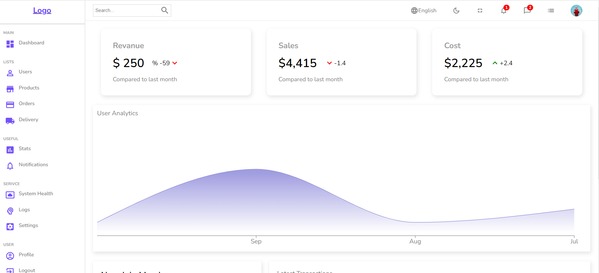
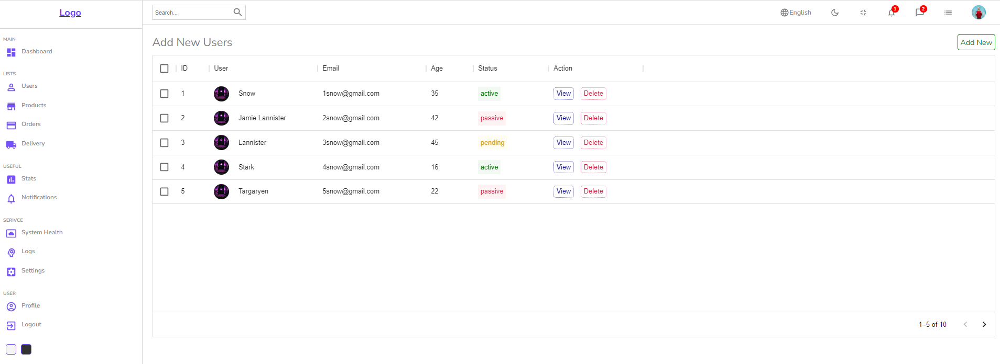
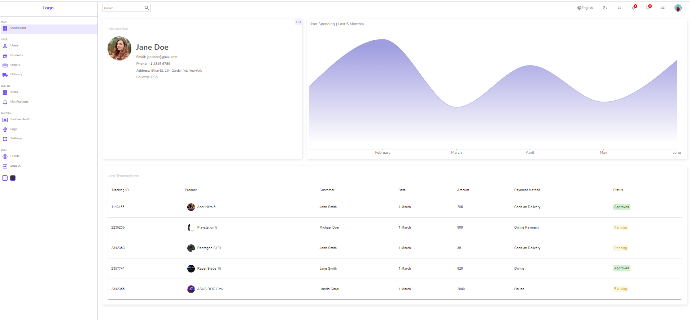
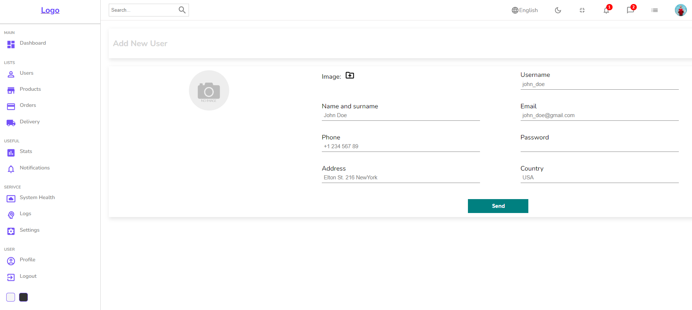
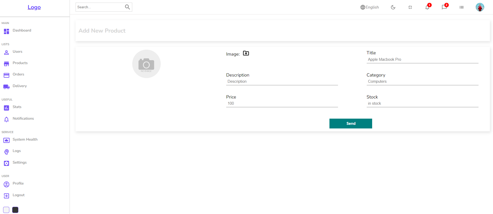

# React Admin Dashboard

React Admin Dashboard. Home page has different widgets, progress bar, interactive chart and a table. The app has different pages with data tables for users, products, signle user and signle product. You can select, view, delete, sort and filter items in theses tables. You can view a signle item in table by clicking on view button.

You can see the website [here](https://react-admin2.herokuapp.com/)

To run the application

1. Clone this repo
2. Run `npm install`
3. Run `npm start

## Built With

* HTML
* CSS
* Javascript
* React
* styled-components
* Material-UI
* React Router
* React Circular Progressbar
* Recharts

## Deployment
Deployed on Heroku

You can see the website [here](https://react-admin2.herokuapp.com/)

## Authors

- **Ali Darraji** - [https://github.com/adarraji](https://github.com/adarraji)

## Screenshots
 

Home Page

 

 
 

 

Users Table Page

 

 
 

 

User Informarion Page

 

 
 

 

New User Page

 

 
 

 

New Product Page

 

 
 
