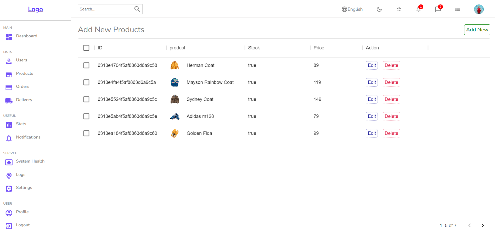

# React Shop Admin Dashboard

React Admin Dashboard. Home page has different widgets, progress bar, interactive chart and a table. The app has different pages with data tables for users, products, signle user and signle product. You can select, view, delete, sort and filter items in theses tables. You can view a signle item in table by clicking on view button.

You can see the website [here](https://react-shop-admin2.herokuapp.com/)

This one part of the full solution.  The backend API is build with Node.js, Express.js and MongoDB You can see it here [here](https://github.com/adarraji/node-shop-api)

Also you can find the React eCommerce Web application [here](https://github.com/adarraji/react-shop)

To run the application

1. Clone this repo
2. Run `npm install`
3. Run `npm start

## Built With

* HTML
* CSS
* Javascript
* React
* styled-components
* Material-UI
* React Router
* React Hooks
* React Redux / Redux toolkit
* Recharts
* FireBase

## Deployment
Deployed on Heroku

You can see the website [here](https://react-shop-admin2.herokuapp.com/)

## Authors

- **Ali Darraji** - [https://github.com/adarraji](https://github.com/adarraji)

## Environmental Variables

### Firebse App Configuration File

Create `src/firebase.js` file and add Firebase app configration in it

### Server URL

Add server url in  `src/requestMethods.js`

## Authors

- **Ali Darraji** - [https://github.com/adarraji](https://github.com/adarraji)

## Screenshots
 

Home Page

 

 

 
 

 

Products Page

 

 
 

 

Product Page

 

 
 

 

New Product Page

 

 
 

 

Users Page

 

 
 

 

User Page

 

 
 

 

New User Page

 

 
 

 

